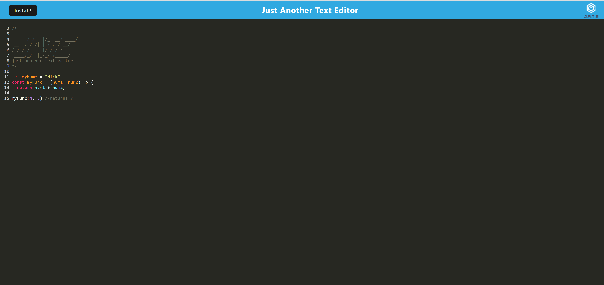

# Text-Editor

## Description: 
This is a single-page progressive web application called "JATE" or "Just-Another-Text-Editor". Users can install this PWA and use it as a text editor to save their code snippets or write text at their own leisure. This application utilizes Express.js, the indexed database, webpacks, and service workers. 

## Table of Contents:
* [Link](#link)
* [Screenshot](#screenshot)
* [Installation](#installation)
* [Usage](#usage)
* [Questions](#questions)
* [License](#license)

## Link:
See the deployed version of the website by visiting the following link:
https://murmuring-lowlands-26712.herokuapp.com/

## Screenshot:

## Installation: 
Please clone the repository from GitHub. This application requires Express. Next, run `npm install i`. Once the dependencies are finished installing, locate your root directory in your bash terminal type the command `npm run build` to create the dist folder, which contains all of your bundled files. Next, from the same location use the command `npm run start` to connect to the server and run the application.

## Usage:
After running `npm run start`, the application will display in the browser on port 3000. Note that you may need to clear your cache if the application doesn't load initially.  
You can install this application onto your desktop by clicking the "Install!" button located near the upper left side of the UI. This will also allow the application to be utilized offline. 

## Questions:
Feel free to contact me at mully7773@gmail.com if you have any questions.  
You can view more of my projects at https://github.com/Mully7773.

## License:
This project is licensed under the MIT license.